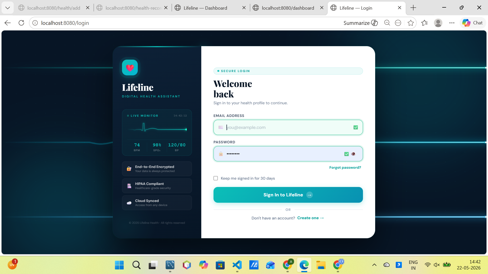
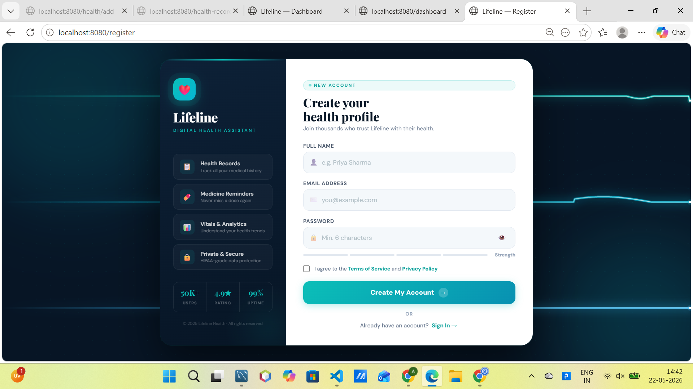
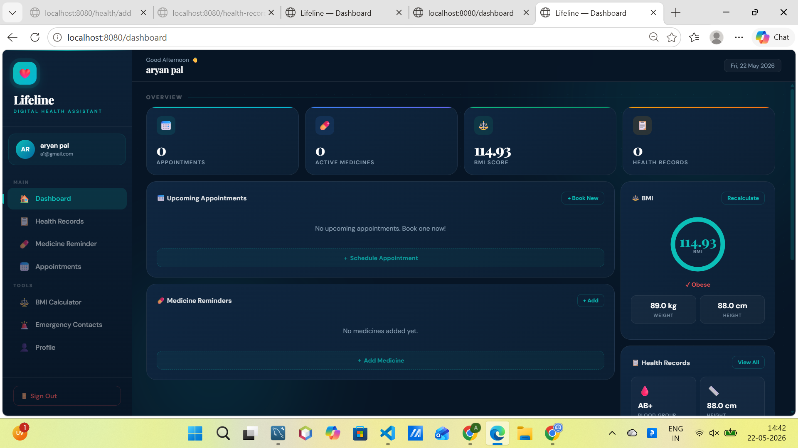
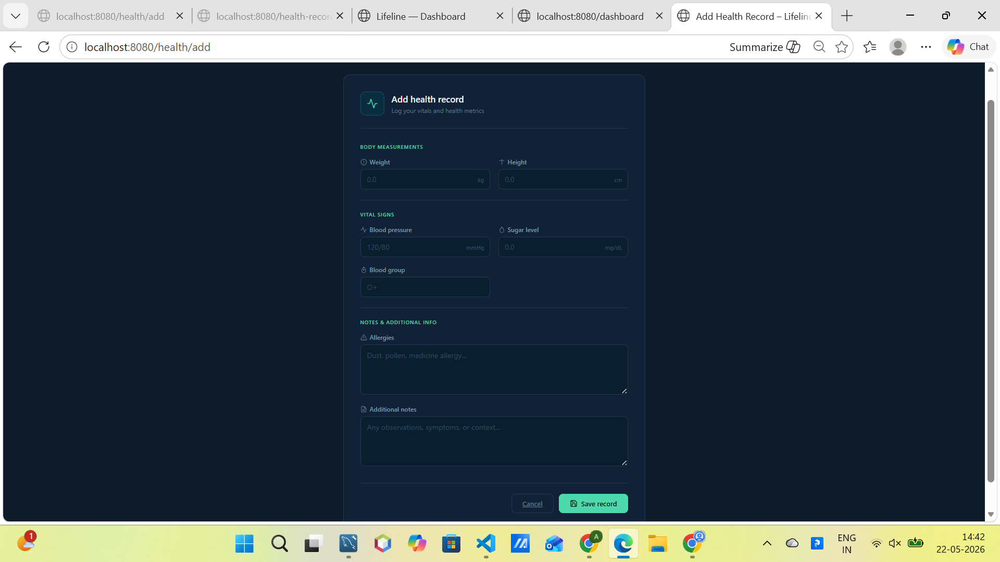
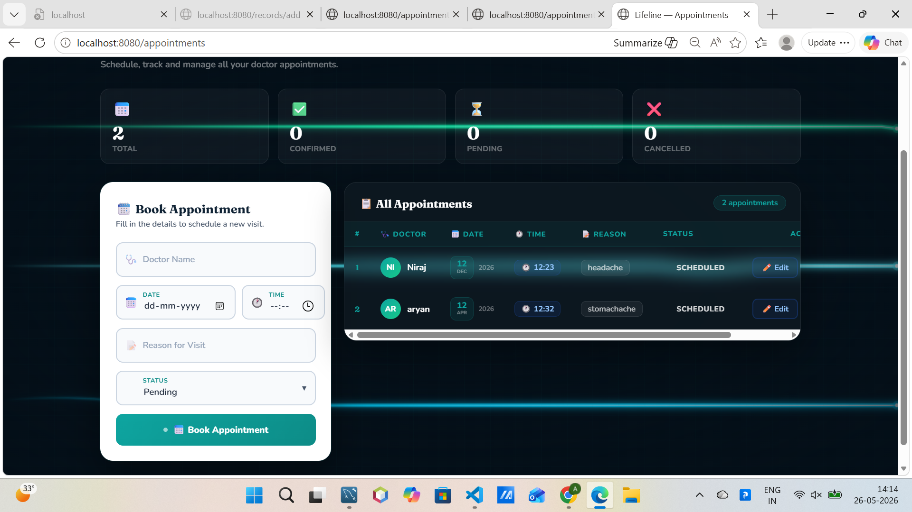

# Lifeline Healthcare System

A modern healthcare management system built using **Spring Boot**, **MySQL**, **Spring Security**, and **Thymeleaf**.

This project helps manage patient health records, authentication, dashboards, BMI analysis, and healthcare-related data efficiently through a clean and responsive web interface.

---

## Features

- User Registration & Login
- Secure Authentication using Spring Security
- Dashboard for Health Record Analytics
- BMI Calculation & Category Detection
- Add & Manage Health Records
- Responsive User Interface
- MySQL Database Integration
- MVC Architecture Implementation

---

## Tech Stack

### Backend
- Java
- Spring Boot
- Spring Security
- Spring Data JPA

### Frontend
- HTML
- CSS
- Thymeleaf
- JavaScript

### Database
- MySQL

### Tools & Version Control
- Git
- GitHub
- VS Code

---

## Project Structure

```bash
src/main/java/com/lifeline/lifeline
│
├── controller
├── service
├── repository
├── entity
├── dto
├── config
```

---

## Modules

### Authentication Module
- User Registration
- Secure Login System
- Password Protection using Spring Security

### Dashboard Module
- Health Statistics Overview
- BMI Information & Category Detection
- Latest Health Record Display

### Health Record Module
- Add Health Records
- Store Patient Information
- Display Medical Data
- Record Management System


### Features Implemented
- Add emergency contacts for emergencies
- Store contact name, relation and phone number
- One-click call button for quick access
- Dashboard integration for fast viewing
- Maximum 5 contacts allowed per user
- Primary contact support
- Automatic primary contact reassignment on deletion
- Phone number validation (10 digits)
- Contact statistics and summary cards

### Dashboard Integration
The dashboard now displays emergency contacts with:
- Contact initials avatar
- Relation information
- Phone number
- Quick call action
- Direct navigation to full contact management page
---

## Workflow

1. User registers or logs into the system
2. Spring Security authenticates the user
3. User accesses the healthcare dashboard
4. Health records are stored in MySQL database
5. Dashboard displays analytics and BMI details
6. Users can manage and track health information

---

## Screenshots

### Login Page


### Register Page


### Dashboard


### Add Record Page


### Appointment Module Screenshot



### Emergency Contact Management


### Dashboard Emergency Contacts Widget


---

## Installation & Setup

### Clone Repository

```bash
git clone https://github.com/aryanpal935/lifeline-healthcare-system.git
```

---

### Open Project

Open the project in:
- VS Code
- IntelliJ IDEA
- Spring Tool Suite

---

### Configure Database

Update your `application.properties` file:

```properties
spring.datasource.url=jdbc:mysql://localhost:3306/lifeline_db
spring.datasource.username=your_username
spring.datasource.password=your_password
```

---

### Run Project

Using Maven:

```bash
mvn spring-boot:run
```

Or run:
`LifelineApplication.java`

---

## Future Improvements

- Appointment Booking System
- Doctor Portal
- JWT Authentication
- Email Notifications
- Report Generation
- Admin Dashboard
- REST API Integration

---

## Learning Goals

This project was developed to improve understanding of:

- Backend Development
- Spring Boot Architecture
- Authentication & Security
- Database Integration
- MVC Design Pattern
- Git & GitHub Workflow
- Layered Application Architecture

---

## Author

### Aryan Virendra Pal

GitHub:  
https://github.com/aryanpal935

---

## License

This project is developed for learning and educational purposes.
